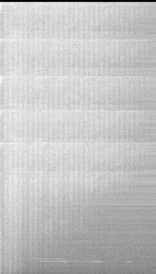
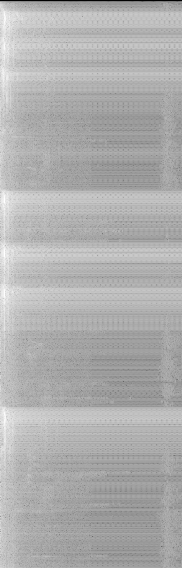
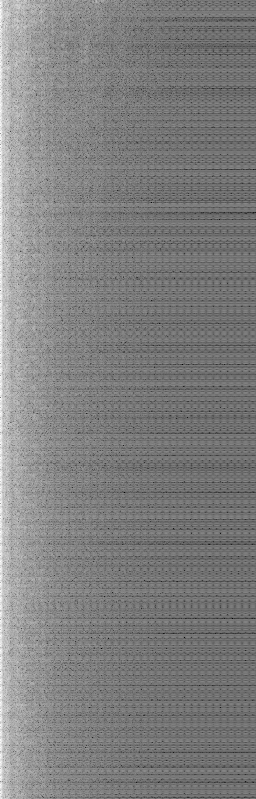
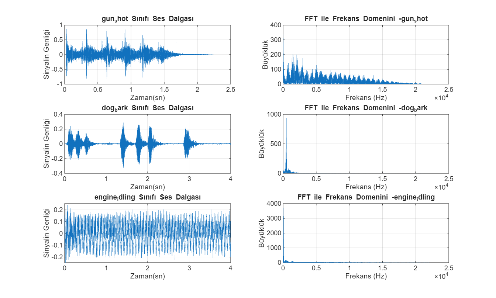
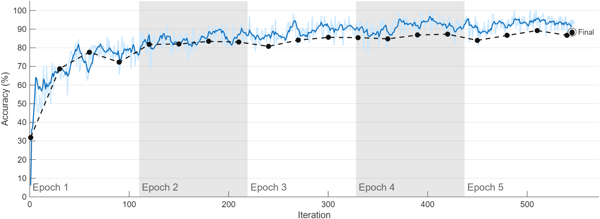
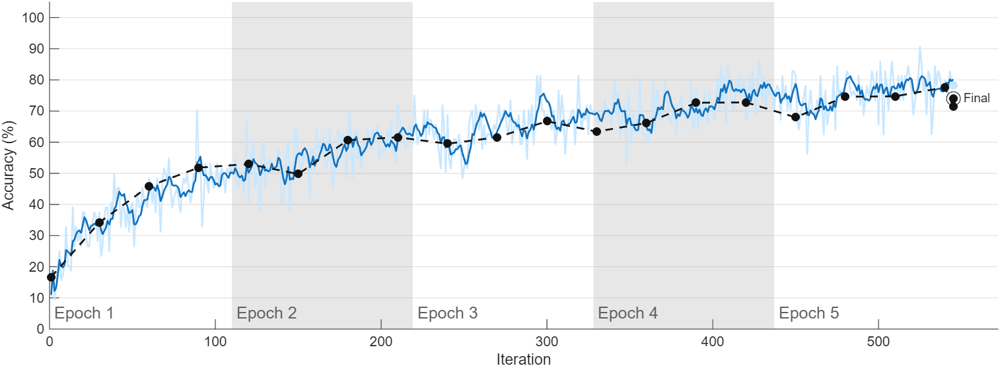
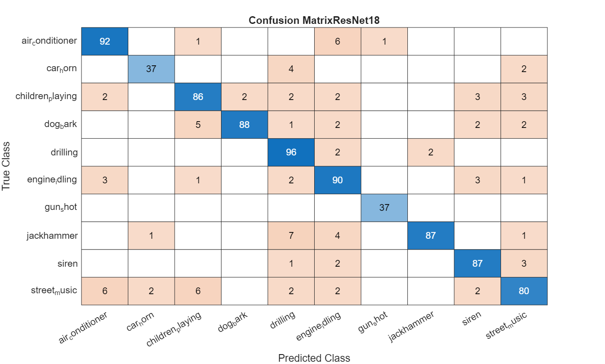
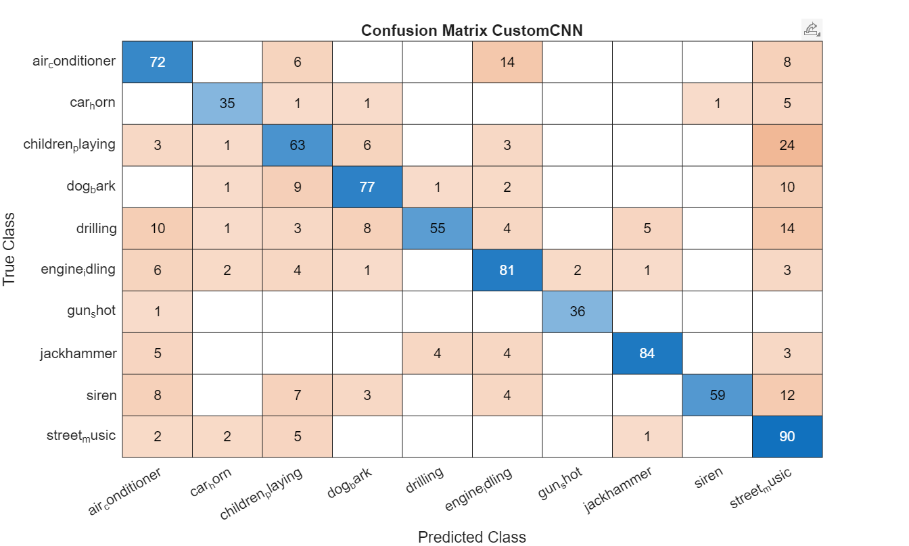

# AcousticSignalClassifier

Ses sinyallerinden FFT ve STFT spektrogramı üreterek derin öğrenme ile sınıflandırma.

## Proje Hakkında

UrbanSound8K veri seti kullanılarak 10 farklı ses sınıfı (gun_shot, dog_bark, engine_idling vb.) sınıflandırıldı. Sinyal işleme pipeline'ı MATLAB ile yazıldı.

## Sinyal İşleme Temelleri

### FFT (Fast Fourier Transform)
Ses sinyali zaman domeninde binlerce sayıdan oluşur. Her sayı o anki ses basıncını temsil eder. FFT bu sinyali frekans domenine taşır: hangi frekansların var olduğunu ve her birinin ne kadar güçlü olduğunu gösterir. Örneğin silah sesi geniş bir frekans aralığına yayılırken köpek havlaması dar ve düşük frekanslarda yoğunlaşır.

### STFT (Short-Time Fourier Transform)
FFT tüm sinyali tek seferde analiz eder ancak zaman bilgisi kaybolur. STFT ise sinyali küçük zaman pencerelerine böler, her pencereye ayrı FFT uygular ve sonuçları yan yana dizer. Çıktı 2D bir görüntüdür: x ekseni zaman, y ekseni frekans, renk ise o anda o frekanstaki enerji miktarı. Bu görüntüye spektrogram denir ve CNN'in girdisi olarak kullanılır.

### Örnek Spektrogramlar

| Sınıf | Ses | Spektrogram |
|-------|-----|-------------|
| gun_shot | [▶ Dinle](results/7061-6-0-0.wav) |  |
| dog_bark | [▶ Dinle](results/7383-3-0-0.wav) |  |
| engine_idling | [▶ Dinle](results/17592-5-0-0.wav) |  |

## Pipeline

1. Ses dosyası yükleme (`load_audio.m`)
2. FFT ile frekans analizi (`plot_fft.m`)
3. STFT ile spektrogram üretimi (`compute_spectrogram.m`)
4. ResNet18 ile sınıflandırma (`train_resnet.m`)
5. CNN ile sınıflandırma (`train_cnn.m`)

## Sonuçlar

| Model | Test Accuracy |
|-------|--------------|
| ResNet18 (Transfer Learning) | %89.35 |
| Custom CNN (Sıfırdan) | %74.68 |

## Nasıl Çalıştırılır

```matlab
% Veriyi yükle
[signal, fs, t] = load_audio('data/fold1/dosya.wav');

% Spektrogram üret
compute_spectrogram(signal, fs, 'class', 'kayit_yolu', 'dosya_adi');

% Modeli eğit
[resnet_model, test_img] = train_resnet();

% Değerlendir
evulate_model(resnet_model, test_img, 'ResNet18');
```

## Görseller

### FFT Karşılaştırması


### Model Eğitim Eğrileri



### Confusion Matrix

